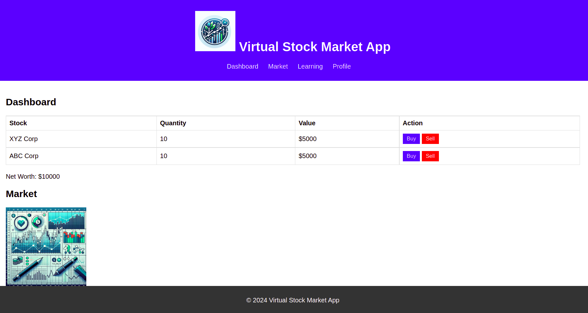

# Virtual Stock Market App

The Virtual Stock Market App is a web application designed to simulate a stock trading environment where users can buy and sell virtual stocks, view market trends, learn about stock trading, and manage their profile.

## Documentation

The project includes comprehensive documentation outlining the design, development plan, and competitive analysis:

- `Code Documentation.pdf`: Detailed information about the codebase, including descriptions of the HTML, CSS, and JavaScript files. It outlines the structures, styles, and scripts that make up the front-end of the app.

- `Competitive Analysis_ Virtual Stock Market App.pdf`: An analysis of competing products in the virtual stock market space. It details the strengths and weaknesses of similar apps and identifies potential areas for our app to differentiate and excel.

- `MRD_ Virtual Stock Market App.pdf`: The Market Requirements Document (MRD) outlines the market needs, target audience, and the intended functionalities of the app. It serves as a blueprint for what the app aims to achieve in the market.

- `PRD_Virtual Stock Market App.pdf`: The Product Requirements Document (PRD) defines the product features, user stories, and technical requirements for the app. This document guides the development process to ensure the final product meets the defined market needs.

- `Roadmap_ Virtual Stock Market App.pdf`: A strategic document that outlines the planned phases of the app's rollout, including milestones and timelines for feature releases and updates.

## Features

- **Dashboard**: Users can view their stock portfolio, and current balance, and perform buy/sell actions.
- **Market**: Displays the trends of various stocks along with news related to the stock market.
- **Learning**: Contains courses and information for users to learn about the stock market.
- **Profile**: Users can view and edit their details like SSN, Address, Name, and Contact Number.

## File Structure

- `index.html` - The main HTML file for the app, containing the structure and links to the CSS and JavaScript files.
- `styles.css` - The stylesheet that contains all the styles for the app.
- `app.js` - The JavaScript file that adds interactivity to the app.
- `/images` - Directory containing all the image files used in the app, including the logo and placeholder images for stock graphs.

## Screenshots

*Dashboard View of the Virtual Stock Market App*

## Getting Started

To get a local copy up and running, follow these simple steps:

1. Clone the repo
git clone https://github.com/your-username/virtual-stock-market-app.git
2. Navigate to the project directory
3. Open `index.html` in your browser to view the app.

## Contributing

Contributions are what make the open-source community such an amazing place to learn, inspire, and create. Any contributions you make are **greatly appreciated**.

1. Fork the Project
2. Create your Feature Branch (`git checkout -b feature/AmazingFeature`)
3. Commit your Changes (`git commit -m 'Add some AmazingFeature'`)
4. Push to the Branch (`git push origin feature/AmazingFeature`)
5. Open a Pull Request

## License

Distributed under the MIT License. See `LICENSE` for more information.

## Contact

LinkedIn - [@sourodip](https://linkedin.com/in/sourodip) - sourodip.ghosh02@gmail.com
Project Link: [https://github.com/Sourodip-ghosh123/virtual-stock-market-app](https://github.com/Sourodip-ghosh123/virtual-stock-market-app)
